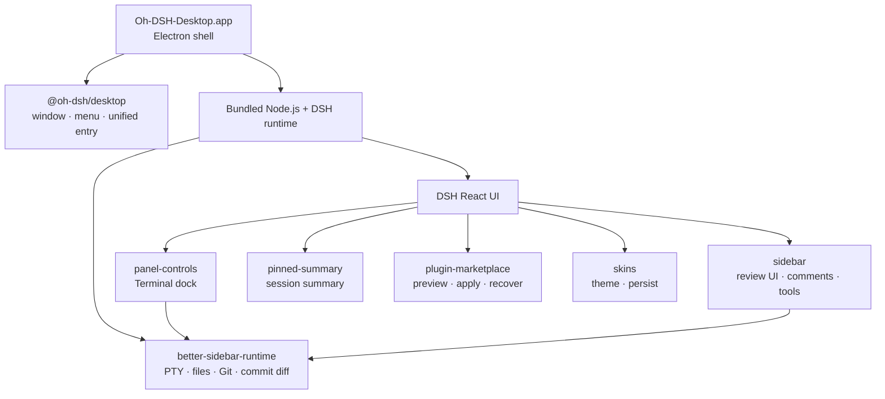
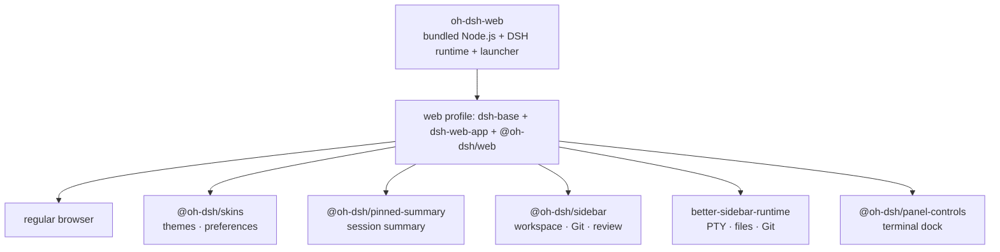

<p align="center">
  <a href="./README.md">简体中文</a> ·
  <strong>English</strong>
</p>

<div align="center">
  
  <h1>Oh-DSH</h1>
  <p><strong>DeepSeek Harness, packaged as installable and extensible interaction surfaces: desktop, web, and TUI.</strong></p>
  <p>
    <a href="#surface-plan">Surface Plan</a> ·
    <a href="#installation">Installation</a> ·
    <a href="#architecture">Architecture</a> ·
    <a href="#bundled-plugins">Bundled Plugins</a> ·
    <a href="#the-oh-dsh-web-distribution">Oh-DSH-Web</a> ·
    <a href="#local-build-and-release">Build and Release</a>
  </p>
</div>

<p align="center">
  
  
  
  
  
  
  
</p>

<p align="center">
  
  <br>
  <sub>Main interface, Side Panel, and the Porcelain desktop skin</sub>
</p>

Oh-DSH is the installable distribution family of DeepSeek Harness: it keeps
the DSH React UI and packages a pinned DSH runtime, Node.js, and local
capabilities into several interaction surfaces. Models still run in the
cloud; the distribution owns the terminal, workspaces, Git, browser, window
integration, and plugin lifecycle.

It is not a second DSH frontend and requires neither a separate Web Terminal
nor a shell plugin. `@oh-dsh/desktop` is the desktop surface entry while
feature modules retain the official DSH Profile, Loader, locale, settings,
and ThemeService contracts.

The repository also ships an **Oh-DSH-Web** browser distribution: the same
DSH web runtime exposed as a standalone HTTP service, packaged separately for
easy installation, with the Oh-DSH skins, Pinned Summary, Sidebar, and PTY
terminal capabilities built in. See
[the Oh-DSH-Web distribution](#the-oh-dsh-web-distribution).

## Surface Plan

The upstream repository has been renamed to **oh-dsh**, and this repository
is its implementation. It provides three interaction surfaces over one pinned
DSH runtime and one set of built-in plugins:

| Surface | Package | Status | Notes |
| --- | --- | --- | --- |
| Desktop | `@oh-dsh/desktop` | ✅ released | Electron desktop surface, macOS / Linux / Windows |
| Web | `@oh-dsh/web` | ✅ implemented here | Oh-DSH-Web browser surface, packaged separately |
| TUI | `@oh-dsh/tui` | ⏳ planned | Terminal surface, reusing the same core |

Built-in plugins (`skins`, `sidebar`, `panel-controls`, `pinned-summary`,
`plugin-marketplace`, ...) adapt to all three surfaces **at the same time**:
they recognize the active surface through the shared `ohDshSurface` service
and branch explicitly (see
[Three surfaces and surface adaptation](#three-surfaces-and-surface-adaptation)).
Each surface can be packaged separately or together; target platforms are
macOS, Linux, and Windows.

## Capabilities

- Self-contained Apple Silicon macOS, Linux x64, and Windows x64 applications and installers.
- Multi-tab PTY Terminal, commit/line Review, Browser, and Files.
- Review comments attach to the message composer for direct Agent handling.
- Pinned Summary, expandable Side Panel, and native window controls.
- Plugin marketplace with isolated preview, discard, apply, and recovery.
- Live Chinese/English switching and four original Oh-DSH skins.
- One transaction and approval boundary for human and Agent plugin actions.

## Interface preview

**Plugin marketplace**: browse a public DSH community catalog and preview changes
in an isolated environment.

<p align="center">
  
</p>

**Desktop skins**: switch instantly from DSH Settings, with the selection
persisted by the Host.

<p align="center">
  
</p>

## Installation

### Install a test build

Download from
[GitHub Releases](https://github.com/hust-open-atom-club/oh-dsh/releases):

- `Oh-DSH-Desktop-0.1.3-arm64.dmg`
- `Oh-DSH-Desktop-0.1.3-arm64.zip`

Open the DMG and drag `Oh-DSH-Desktop.app` into `Applications`. The current
test build has no Developer ID signature or notarization. On first launch,
right-click the application in Finder and choose **Open** if required.

If macOS prevents the DMG from opening, first verify that it was downloaded
from this project's GitHub Release, then remove its quarantine attribute and
open it again. Replace the example DMG path with the file's actual download
path:

```sh
xattr -d com.apple.quarantine ~/Downloads/Oh-DSH-Desktop-0.1.3-arm64.dmg
```

Download from
[GitHub Releases](https://github.com/hust-open-atom-club/oh-dsh/releases):

- `Oh-DSH-Desktop-0.1.3-x86_64.AppImage`
- `Oh-DSH-Desktop-0.1.3-amd64.deb`

Make the AppImage executable and run it:

```sh
chmod +x Oh-DSH-Desktop-0.1.3-x86_64.AppImage
./Oh-DSH-Desktop-0.1.3-x86_64.AppImage
```

Or install the deb package with apt:

```sh
sudo apt install ./Oh-DSH-Desktop-0.1.3-amd64.deb
```

### Install the Oh-DSH-Web distribution

Download `oh-dsh-web-<version>-<platform>-<arch>.tar.gz` (or `.zip`) from the
Release, extract, and run:

```sh
tar -xzf oh-dsh-web-0.1.3-linux-x64.tar.gz
cd oh-dsh-web-0.1.3-linux-x64
./bin/oh-dsh-web
```

The launcher prints the URL (default `http://127.0.0.1:3080`) and opens the
browser on an interactive terminal. The first run creates the `~/.oh-dsh-web`
data root. Common options:

| Option | Default | Meaning |
| --- | --- | --- |
| `--host` / `DSH_OH_WEB_HOST` | `127.0.0.1` | Bind host; `0.0.0.0` exposes the UI on the LAN and requires `--trusted-host` |
| `--port` / `DSH_OH_WEB_PORT` | `3080` | Listen port; `0` picks a random port |
| `--data` / `DSH_OH_WEB_HOME` | `~/.oh-dsh-web` | Writable data root |
| `--no-open` / `DSH_OH_WEB_OPEN=0` | auto-open | Do not open the browser |
| `--trusted-host <auth>` | — | Extra authority for the browser-trust fence (repeatable) |

`Ctrl+C` stops the runtime gracefully. Oh-DSH-Web reuses the same pinned DSH
runtime and bundles the Oh-DSH skins, Pinned Summary, Sidebar
(Files/Git/Review), and PTY terminal capabilities; only Electron-bound
capabilities (desktop window chrome, the plugin marketplace bridge) stay with
the desktop distribution.

### Run from source

Requirements: macOS 12+ with Apple Silicon, or Linux x64, plus Node.js 24+,
pnpm 11+. macOS additionally needs Xcode Command Line Tools; Linux needs a
basic build toolchain (make, g++, python3).

```sh
git submodule update --init --recursive
pnpm install
pnpm run build:dsh
pnpm start
```

The Better Sidebar Host is pinned as a Git submodule and fetched from a public
HTTPS repository; initializing it requires neither SSH nor GitHub CLI
authentication. The pinned DSH source is acquired separately and can also be
provided through the `DSH_SOURCE` override described below. Published DMG,
ZIP, AppImage, and deb artifacts already contain the compiled output and
require no repository access.

Release builds pin DSH `0.1.0-rc.5` (the npm `0.1.0-rc.6` package is the
publicly published version number of this same code) from the official public
repository at:

```text
47f943859bef60e4160492346772ded9b24f765a
```

The first build stores the source under `.cache/dsh-source/`. Set
`DSH_SOURCE=/absolute/path` to use another checkout; its package version must
still match the pinned version.

Writable runtime state lives at:

```text
macOS  ~/Library/Application Support/Oh-DSH-Desktop/dsh
Linux  ~/.config/Oh-DSH-Desktop/dsh
```

Configure the DeepSeek API key in DSH Settings or in the `.env` file under
that directory.

## Desktop controls

| Action | Shortcut |
| --- | --- |
| Toggle the DSH left sidebar | `⌘B` |
| Toggle the bottom Terminal | `⌘J` |
| Toggle the Side Panel | `⌥⌘B` |
| Open Review | `⌃⇧G` |
| Open Browser | `⌘T` |
| Open Files | `⌘P` |
| Start a Side chat | `⌥⌘S` |
| Leave Side Panel focus mode | `Esc` |

Opening the Side Panel collapses Pinned Summary and reveals the expand
control. Terminal and Side Panel remain independently toggleable.

## Architecture



`cordis.patch.yml` reuses `dsh-base` and `dsh-web-app`, starts the Web runtime
on a random loopback port, and loads desktop plugins in dependency order.
Third-party plugins remain managed by the DSH Profile and Loader.

## Bundled plugins

| Plugin | Upstream relationship | Oh-DSH adaptation |
| --- | --- | --- |
| `@oh-dsh/desktop` | Original Oh-DSH component | Unified desktop entry, Electron bridge, native menus, windows, Agent capabilities, and bundled plugin order |
| `@oh-dsh/better-sidebar-runtime` | Pinned [`DSH-better-sidebar`](https://github.com/omdsh-dev/DSH-better-sidebar) submodule | Compiles the upstream Host only for PTY, Files, Git, history, and commit diff; the upstream UI is not loaded |
| `@oh-dsh/panel-controls` | Downstream reimplementation of the early dsh-web-panel interaction model | Keeps the Oh-DSH Terminal dock, themes, localization, and Session state on the shared PTY Host; no separate Web Terminal installation |
| `@oh-dsh/pinned-summary` | Original Oh-DSH component | Active Session summary, half-height card, and conversation gutter |
| `@oh-dsh/sidebar` | Oh-DSH UI downstream of [`DSH-better-sidebar`](https://github.com/omdsh-dev/DSH-better-sidebar) | Uses the shared Host for Session tabs, viewers, Files, Git Review, line comments, and Agent composer references while retaining the current layout, icons, and themes |
| `@oh-dsh/plugin-marketplace` | Supports [`plugin-registry`](https://github.com/vlln/plugin-registry), [`dsh-hub`](https://github.com/omdsh-dev/dsh-hub), and the public [`dsh-suite`](https://github.com/whyihaveyou/dsh-suite) catalog | Unifies isolated preview, risk review, TOFU source locks, apply, and recovery with desktop navigation and bilingual UI |
| `@oh-dsh/skins` | Downstream reimplementation of the early dsh-skins ThemeService extension model | Retains the ThemeService extension model but redesigns skins, Settings UI, and Host persistence |

Plugins marked as downstream adaptations or distilled designs are reviewed
against upstream releases and features regularly. Compatible features are
ported through the current DSH contracts; syncing does not overwrite Oh-DSH
UI, themes, or desktop interactions.

`@oh-dsh/skins` and `@oh-dsh/pinned-summary` do not depend on
Electron and are enabled in the Oh-DSH-Web browser distribution as well; the
remaining plugins need the desktop Host (PTY, Electron bridge, marketplace
transactions) or the desktop interaction surface.

## Three surfaces and surface adaptation

Built-in Oh-DSH plugins recognize the active interaction form through one
shared `ohDshSurface` service (see `plugins/shared/surface.ts`) and adapt
explicitly per surface. Each shell bundle provides the service:

| Surface | Shell | `kind` | Notes |
| --- | --- | --- | --- |
| Desktop | `@oh-dsh/desktop` (Electron) | `desktop` | Native windows, menus, Electron bridge, full local capability set |
| Web | `@oh-dsh/web` (browser) | `web` | DSH Web UI over HTTP; the browser client graph matches Desktop wherever host services exist |
| TUI | `@oh-dsh/tui` (planned) | `tui` | No browser client graph; host rows that need `webServer` never activate |

Plugin adaptations are written as explicit three-way branches:

- `skins` host: `desktop` / `web` mount the preferences server (data root from
  the surface service); `tui` does not activate.
- `sidebar` host: pure Node (workspace/Git/preferences), mounted on `desktop`
  and `web`; `tui` does not activate.
- `plugin-marketplace` client: `desktop` uses the Electron bridge; `web`
  skips with a notice (an HTTP transport is roadmap work); `tui` has no
  browser graph.
- `panel-controls` / `pinned-summary`: browser-only clients; surface
  differences are expressed by profile composition (TUI mounts no browser
  rows).
- `better-sidebar-runtime`: pure Node host (PTY/Files/Git), mounted on both
  `desktop` and `web`; the PTY terminal works in the browser too.

On the client plane, the shell clients reflect the same `ohDshSurface`
service (`desktop` / `web`) for browser-side plugins to read.

See [THIRD_PARTY_NOTICES.md](./THIRD_PARTY_NOTICES.md) for source and license
details.

## The Oh-DSH-Web distribution

Oh-DSH-Web is the browser distribution of this repository: it reuses
`dsh-base` + `dsh-web-app`, exposes the DSH Web UI through the `web` profile
as a standalone HTTP service, and mounts the web-capable Oh-DSH plugins. The
browser client graph matches the desktop distribution: skins, Pinned Summary,
the Sidebar (Files/Git/Review/preferences), and the PTY terminal dock are all
available. Only Electron-bound pieces (desktop window chrome, the plugin
marketplace bridge) are not included.



`@oh-dsh/web` is the third bundle of the `web` profile: it provides the
Oh-DSH-Web surface identity (the `ohDshSurface` service, prompt, bash
environment variables) and the plugin rows. The launcher (`bin/oh-dsh-web`)
initializes the `web` profile, boots the pinned DSH runtime, prints the URL,
optionally opens the browser, and stops gracefully on `Ctrl+C`.

## Plugin marketplace

The **Plugins** page defaults to the public
`whyihaveyou/dsh-suite/data/plugins.json` catalog and preserves each entry's
canonical `owner/repo` identity. Install, update, enable, disable, and
uninstall operations first create an isolated candidate Profile:

```text
verify the source and exact commit
        ↓
install and launch an isolated preview Profile
        ↓
discard (live desktop unchanged) or apply (retain previous)
        ↓
Undo restores the previous Profile when needed
```

The Agent can enter the same workflow through conversation. Apply and recover
still require human approval and cannot bypass preview or introduce a second
DSH Loader. Private repositories authenticate through GitHub CLI:

```sh
gh auth login
```

Set `OH_DSH_MARKETPLACE_CATALOG=owner/repository/path/to/catalog.json` to use
a compatible `dsh-external-hub/v0.1`, `omdsh-registry/v1`, or `dsh-suite` 1.0
catalog.

## Security boundaries

- DSH Web runtime and Agent management bind only to random loopback ports.
- Browser uses an isolated Electron partition without Node.js or preload.
- The Better Sidebar Host enforces Session and Workspace bounds for Files and Git.
- Marketplace candidates pin Git commits, block install scripts by default,
  and leave the live Profile unchanged until apply.
- The pnpm release-age policy stays enabled, excluding only `@deepseek-ai/*`.

## Local build and release

A complete build rebuilds the pinned DSH source. Use the quick build when the
cache is already current:

```sh
pnpm run dist:mac          # Apple Silicon
pnpm run dist:mac:x64      # Intel
pnpm run dist:linux
pnpm run dist:win
# or
pnpm run dist:mac:quick
pnpm run dist:linux:quick
pnpm run dist:win:quick
```

macOS artifacts are written to `release/`:

```text
release/
├── Oh-DSH-Desktop-0.1.3-arm64.dmg
├── Oh-DSH-Desktop-0.1.3-arm64.zip
└── mac-arm64/Oh-DSH-Desktop.app
```

The Oh-DSH-Web distribution shares the same stage; the Node platform/arch is
picked automatically from the current process (override with
`DSH_DESKTOP_NODE_PLATFORM`/`DSH_DESKTOP_NODE_ARCH` for cross-packaging):

```sh
pnpm run dist:web
# or
pnpm run dist:web:quick
```

Web artifacts are written to `release/`:

```text
release/
├── oh-dsh-web-0.1.3-darwin-arm64/
├── oh-dsh-web-0.1.3-darwin-arm64.tar.gz
└── oh-dsh-web-0.1.3-darwin-arm64.zip
```

Linux artifacts are written to the same directory:

```text
release/
├── Oh-DSH-Desktop-0.1.3-x86_64.AppImage
├── Oh-DSH-Desktop-0.1.3-amd64.deb
└── linux-unpacked/oh-dsh-desktop
```

The bundled Node runtime defaults to the build machine's platform. Set
`DSH_DESKTOP_NODE_PLATFORM` (`linux`/`darwin`/`win`) and `DSH_DESKTOP_NODE_ARCH`
(`x64`/`arm64`) to stage a different target for cross-packaging.

## GitHub Actions release flow

[`.github/workflows/ci.yml`](.github/workflows/ci.yml) calls
[`.github/workflows/checks.yml`](.github/workflows/checks.yml) on every PR
and main push. It runs install, type check, tests, and the build in parallel
on macOS arm64, Linux x64, and Windows x64, covering the compile
path of every surface on every target platform. Runtime smoke builds and
stages the pinned DSH runtime on Linux and Windows. Linux then runs the
assembled desktop and web profiles (smoke:runtime / smoke:web); Windows
verifies junction-free staging and smoke:web, and skips the Electron GUI
smoke.

Pushing a `v*` tag runs
[`.github/workflows/release.yml`](.github/workflows/release.yml), which
packages macOS arm64, Linux x64, and Windows x64 in parallel. Each
platform produces the desktop package (DMG/ZIP, AppImage/deb, Windows ZIP)
and the Oh-DSH-Web package (tar.gz/ZIP). After every job passes, a publish
job attaches all artifacts to a same-named GitHub Release via
`gh release create`; any failure blocks the release. You can also click Run workflow in Actions. Enter a tag such as
`v0.1.3` to publish a GitHub Release pointing at the built commit; leave
it empty to upload artifacts only. The tag must match the
`package.json` version (a suffix like `v0.1.3-rc.1` is allowed).

[`dsh-source.json`](dsh-source.json) is maintained by
[`.github/workflows/sync-upstream.yml`](.github/workflows/sync-upstream.yml).
Once a day it resolves the `master` HEAD of
`deepseek-ai/deepseek-harness`. If the commit changed, the same `checks.yml`
suite runs on every platform; on success `github-actions[bot]` writes the pin
and pushes to `main`. A failure opens a deduplicated `upstream-sync` issue
and leaves the pin unchanged. The bot push does not re-trigger CI — the
revision was already verified. Locally,
`node scripts/set-dsh-source.mjs --dry-run` shows the revision that would be
synced.

You can still verify locally before upload:

```sh
pnpm run typecheck
pnpm test
pnpm run dist:mac
pnpm run smoke:app
codesign --verify --deep --strict \
  release/mac-arm64/Oh-DSH-Desktop.app
hdiutil verify release/Oh-DSH-Desktop-0.1.3-arm64.dmg
pnpm run dist:web
pnpm run smoke:web:package
```

On Linux, verify with:

```sh
pnpm run typecheck
pnpm test
pnpm run dist:linux
pnpm run smoke:app:linux
```

On Windows, verify with:

```sh
pnpm run typecheck
pnpm test
pnpm run dist:win
pnpm run dist:web
```

Workspace package metadata and download instructions must use the same
version. Pushing the matching `v*` tag runs the release workflow, packages
every surface, and creates the GitHub Release. For later versions, update
every workspace package first and then push the tag at that same version.

## License

[BSD 3-Clause](./LICENSE)
