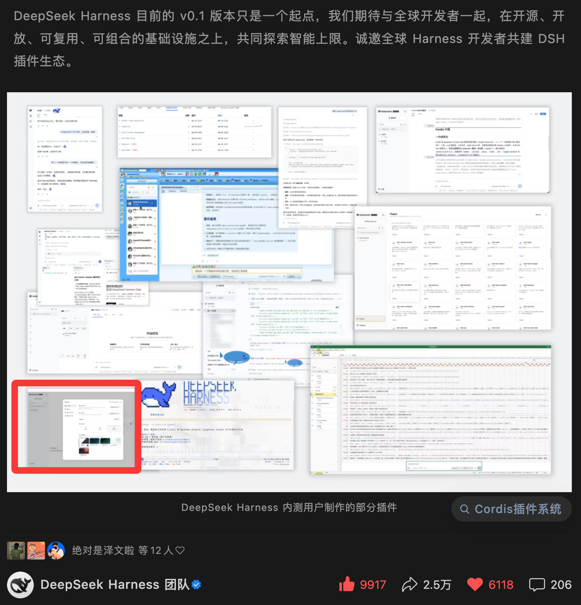

<p align="center">
  <a href="./README.md">简体中文</a> ·
  <strong>English</strong>
</p>

<div align="center">
  
  <h1>Oh-DSH</h1>
  <p><strong>One DSH runtime, independently installable interaction surfaces.</strong></p>
</div>

<p align="center">
  
  
  
  
  
</p>

<p align="center">
  
</p>

Oh-DSH packages DeepSeek Harness, Node.js, and local capabilities as
installable Desktop, Web, and TUI distributions. Models still run in the
cloud; Oh-DSH owns workspaces, terminals, Git review, browser and window
integration, and the plugin lifecycle.

## 🎉 Official showcase

Oh-DSH has been included in the official DeepSeek Harness community showcase.
Its terminal surface builds on the similarly recognized
[dsh-TUI](https://github.com/ccch1mneyyy/dsh-TUI) upstream plugin with full
attribution preserved.

<p align="center">
  
</p>

## Download and install

Choose a distribution from the
[latest GitHub Release](https://github.com/hust-open-atom-club/oh-dsh/releases/latest):

| Distribution | Includes | Best for |
| --- | --- | --- |
| Full | **Oh-DSH Desktop**, Web, TUI, Node runtime, and bundled plugins | Local development workbench |
| Web-only | **Oh-DSH Web**, Node runtime, and bundled Web plugins; no Electron | Small installs, browser, or remote access |
| TUI-only | **Oh-DSH TUI**, Node runtime, and terminal plugins; no Electron | Terminal-only environments |

The full distribution is available as DMG/ZIP, AppImage/deb, and a Windows
package. On macOS, open the DMG and drag **Oh-DSH Desktop** into Applications.
On Linux, run the AppImage or install the deb with `apt`.

Extract and start the Web-only package directly:

```sh
tar -xzf oh-dsh-web-*.tar.gz
cd oh-dsh-web-*/
./bin/ohdsh web
```

The default URL is <http://127.0.0.1:3080>. On Windows, run:

```bat
bin\ohdsh.cmd web
```

The TUI-only package is also ready after extraction:

```sh
tar -xzf oh-dsh-tui-*.tar.gz
cd oh-dsh-tui-*/
./bin/ohdsh tui
```

### Install the unified command

The macOS full distribution contains a CLI that can be added to `PATH`:

```sh
sudo ln -sf \
  "/Applications/Oh-DSH Desktop.app/Contents/Resources/bin/ohdsh" \
  /usr/local/bin/ohdsh
```

Use `./bin/ohdsh` from a Web-only or TUI-only package, or add it to `PATH`.

## Start a surface

```sh
ohdsh desktop   # Start Oh-DSH Desktop
ohdsh web       # Start Oh-DSH Web
ohdsh tui       # Start Oh-DSH TUI
```

Run `ohdsh web --help` or `ohdsh tui --help` for surface-specific options.

## Run from source

Node.js, pnpm, and the platform build tools are required:

```sh
git submodule update --init --recursive
pnpm install
pnpm run build:dsh
pnpm run build
pnpm run stage:dsh
export PATH="$PWD/bin:$PATH"

ohdsh desktop
ohdsh web
ohdsh tui
```

Build the full distribution with the platform-specific `dist:mac`,
`dist:linux`, or `dist:win` script. Build only Web with `pnpm run dist:web`,
or only TUI with `pnpm run dist:tui`.

<details>
<summary><strong>More interfaces</strong></summary>

### Plugin marketplace


### Oh-DSH skins


</details>

## Documentation

- [Design and plugin boundaries](./docs/design.en.md)
- [Installation, operations, and troubleshooting](./docs/usage.en.md)

## Upstream dependencies

| Upstream repository | Role in Oh-DSH |
| --- | --- |
| [DeepSeek Harness](https://github.com/deepseek-harness/deepseek-harness) | DSH runtime, sessions, and plugin loader |
| [dsh-TUI](https://github.com/ccch1mneyyy/dsh-TUI) | **Direct upstream plugin for Oh-DSH TUI**, providing terminal rendering, interaction, and commands |
| [DSH-better-sidebar](https://github.com/omdsh-dev/DSH-better-sidebar) | Git review, files, and PTY host capabilities |

`dsh-TUI` is pinned as a Git submodule at `upstream/dsh-TUI`. Oh-DSH keeps
the upstream implementation and attribution, while owning the `ohdsh tui`
launcher, isolated `~/.ohdsh` data, unified title, cross-surface skins, and
distribution packaging. See the design guide for the exact boundary.

## License

[MIT](./LICENSE)
