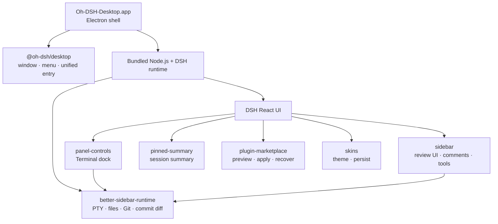
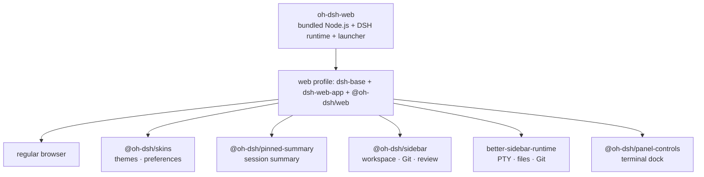

<p align="center">
  <strong>简体中文</strong> ·
  <a href="./README.en.md">English</a>
</p>

<div align="center">
  
  <h1>Oh-DSH</h1>
  <p><strong>把 DeepSeek Harness 装进可安装、可扩展的多种交互形态：桌面、Web 与 TUI。</strong></p>
  <p>
    <a href="#形态计划">形态计划</a> ·
    <a href="#安装">安装</a> ·
    <a href="#架构">架构</a> ·
    <a href="#内置-plugins">内置 Plugins</a> ·
    <a href="#oh-dsh-web-发行版">Oh-DSH-Web</a> ·
    <a href="#本地构建与发布">构建与发布</a>
  </p>
</div>

<p align="center">
  
  
  
  
  
  
  
</p>

<p align="center">
  
  <br>
  <sub>主界面、Side Panel 与 Porcelain 桌面皮肤</sub>
</p>

Oh-DSH 是 DeepSeek Harness 的可安装发行家族：保留 DSH React UI，把固定版本
的 DSH runtime、Node.js 和本地能力打包成多种交互形态。模型仍运行在云端，
发行版负责终端、Workspace、Git、浏览器、窗口集成和 plugin 生命周期。

它不是另一套 DSH 前端，也不需要额外安装 Web Terminal 或 shell plugin。
`@oh-dsh/desktop` 提供桌面形态的统一入口，功能模块继续沿用 DSH 官方的
Profile、Loader、locale、settings 和 ThemeService 契约。

仓库同时提供 **Oh-DSH-Web** 浏览器发行版：把同一个 DSH web runtime 暴露
为独立的 HTTP 服务，可以单独打包安装，并自带 Oh-DSH 的皮肤、Pinned
Summary、Sidebar 与 PTY 终端能力。见 [Oh-DSH-Web 发行版](#oh-dsh-web-发行版)。

## 形态计划

上游仓库已更名为 **oh-dsh**，本仓库作为其实现，统一提供三种交互形态，
全部复用同一份固定的 DSH runtime 与同一套内置插件：

| 形态 | 包 | 状态 | 说明 |
| --- | --- | --- | --- |
| Desktop | `@oh-dsh/desktop` | ✅ 已发布 | Electron 桌面形态，macOS / Linux / Windows |
| Web | `@oh-dsh/web` | ✅ 本仓库实现 | Oh-DSH-Web 浏览器形态，可独立打包安装 |
| TUI | `@oh-dsh/tui` | ⏳ 计划中 | 终端形态，复用同一份 core |

内置插件（`skins`、`sidebar`、`panel-controls`、`pinned-summary`、
`plugin-marketplace` 等）将针对这三种形态**同时适配**：通过统一的
`ohDshSurface` 服务自动识别当前形态并显式分支（见下文
「三种形态与表面适配」）。三种形态可以分开打包，也可以合并分发；每个形态
的目标平台为 macOS、Linux 与 Windows。

## 主要能力

- 自包含的 Apple Silicon macOS 应用与安装包、Linux x64 AppImage / deb、Windows x64 ZIP。
- 多标签 PTY Terminal、逐提交/逐行 Review、Browser 和 Files。
- Review 评论可汇总进消息输入框，直接交给 Agent 处理。
- Pinned Summary、可展开 Side Panel 与原生窗口控制。
- 支持隔离预览、放弃、应用和恢复的插件市场。
- 中英文实时切换，以及四套 Oh-DSH 自有桌面皮肤。
- 人类 UI 与 Agent 共用同一套插件安装事务和审批边界。

## 界面预览

**插件市场**：浏览公共 DSH 社区目录，并在隔离环境中预览变更。

<p align="center">
  
</p>

**桌面皮肤**：在 DSH 设置页即时切换，由 Host 持久化选择。

<p align="center">
  
</p>

## 安装

### 安装测试包

从 [GitHub Releases](https://github.com/hust-open-atom-club/oh-dsh/releases)
下载：

- `Oh-DSH-Desktop-0.1.3-arm64.dmg`
- `Oh-DSH-Desktop-0.1.3-arm64.zip`

打开 DMG，把 `Oh-DSH-Desktop.app` 拖入 `Applications`。当前测试包没有
Developer ID 和 notarization，首次启动时可在 Finder 中右键应用并选择
“打开”。

如果 macOS 阻止打开 DMG，请先确认文件下载自本项目的 GitHub Release，
再移除该 DMG 的 quarantine 属性并重新打开。请将示例中的 DMG 路径替换为
文件的实际下载路径：

```sh
xattr -d com.apple.quarantine ~/Downloads/Oh-DSH-Desktop-0.1.3-arm64.dmg
```

#### Linux

从 [GitHub Releases](https://github.com/hust-open-atom-club/oh-dsh/releases)
下载：

- `Oh-DSH-Desktop-0.1.3-x86_64.AppImage`
- `Oh-DSH-Desktop-0.1.3-amd64.deb`

AppImage 只需赋予执行权限后直接运行：

```sh
chmod +x Oh-DSH-Desktop-0.1.3-x86_64.AppImage
./Oh-DSH-Desktop-0.1.3-x86_64.AppImage
```

也可以安装 deb 包（需要 apt）：

```sh
sudo apt install ./Oh-DSH-Desktop-0.1.3-amd64.deb
```

Linux 运行数据位于 `~/.config/Oh-DSH-Desktop/dsh`，DeepSeek API key 可以
在 DSH 设置页配置，也可以写入该目录下的 `.env`。

### 安装 Oh-DSH-Web 发行版

从 Release 下载 `oh-dsh-web-<version>-<platform>-<arch>.tar.gz`（或
`.zip`），解压后直接运行：

```sh
tar -xzf oh-dsh-web-0.1.3-linux-x64.tar.gz
cd oh-dsh-web-0.1.3-linux-x64
./bin/oh-dsh-web
```

启动后终端会打印地址（默认 `http://127.0.0.1:3080`），交互式终端下自动
打开浏览器。首次启动创建 `~/.oh-dsh-web` 数据目录。常用选项：

| 选项 | 默认 | 说明 |
| --- | --- | --- |
| `--host` / `DSH_OH_WEB_HOST` | `127.0.0.1` | 监听地址；`0.0.0.0` 暴露到局域网（必须同时配置 `--trusted-host`） |
| `--port` / `DSH_OH_WEB_PORT` | `3080` | 监听端口；`0` 表示随机端口 |
| `--data` / `DSH_OH_WEB_HOME` | `~/.oh-dsh-web` | 可写数据根目录 |
| `--no-open` / `DSH_OH_WEB_OPEN=0` | 自动打开 | 不自动打开浏览器 |
| `--trusted-host <auth>` | — | 浏览器信任围栏的额外 authority（可重复） |

`Ctrl+C` 优雅退出。Oh-DSH-Web 复用同一套固定 DSH runtime（见下文
“本地构建与发布”），自带 Oh-DSH 皮肤、Pinned Summary、Sidebar
（Files/Git/Review）与 PTY 终端；仅 Electron 绑定的能力（桌面窗口 chrome、
插件市场 bridge）保留在桌面发行版中。

### 从源码运行

macOS 要求 macOS 12+、Apple Silicon、Node.js 24+、pnpm 11+ 和 Xcode
Command Line Tools。Linux 要求 x64、Node.js 24+、pnpm 11+ 与基础构建
工具链（make、g++、python3），发行版之间无额外依赖。

```sh
git submodule update --init --recursive
pnpm install
pnpm run build:dsh
pnpm start
```

Better Sidebar Host 以固定 Git submodule 跟踪，并通过公开 HTTPS 仓库获取；
初始化该 submodule 不需要 SSH 或 GitHub CLI 认证。固定的 DSH 源码单独获取，
也可以通过下述 `DSH_SOURCE` 指向已有 checkout。已发布的 DMG、ZIP、AppImage
和 deb 已包含编译产物，不需要仓库权限。

发行构建固定使用 DSH `0.1.0-rc.5`（npm 上的 `0.1.0-rc.6` 即同一份代码的
公开发布版本号），源码来自官方公共仓库：

```text
47f943859bef60e4160492346772ded9b24f765a
```

首次构建会把源码放进 `.cache/dsh-source/`。如需使用另一个 checkout，可设置
`DSH_SOURCE=/absolute/path`，但 package version 必须与固定版本一致。

运行数据位于：

```text
macOS  ~/Library/Application Support/Oh-DSH-Desktop/dsh
Linux  ~/.config/Oh-DSH-Desktop/dsh
```

DeepSeek API key 可以在 DSH 设置页配置，也可以写入该目录下的 `.env`。

## 常用操作

| 操作 | 快捷键 |
| --- | --- |
| 切换 DSH 左侧栏 | `⌘B` |
| 切换底部 Terminal | `⌘J` |
| 切换 Side Panel | `⌥⌘B` |
| 打开 Review | `⌃⇧G` |
| 打开 Browser | `⌘T` |
| 打开 Files | `⌘P` |
| 新建 Side chat | `⌥⌘S` |
| 退出 Side Panel 专注模式 | `Esc` |

Side Panel 打开时会收起 Pinned Summary，并显示全屏展开按钮。Terminal 与
Side Panel 可以独立开关。

## 架构



`cordis.patch.yml` 复用 `dsh-base` 与 `dsh-web-app`，在随机 loopback 端口
启动 Web runtime，再按依赖顺序加载桌面 plugins。第三方插件仍由 DSH
Profile 和 Loader 管理。

## 内置 plugins

| Plugin | 来源关系 | Oh-DSH 改造 |
| --- | --- | --- |
| `@oh-dsh/desktop` | Oh-DSH 自研 | 统一桌面入口、Electron bridge、原生菜单、窗口、Agent 能力与内置 plugin 注册顺序 |
| `@oh-dsh/better-sidebar-runtime` | 固定跟踪 [`DSH-better-sidebar`](https://github.com/omdsh-dev/DSH-better-sidebar) submodule | 仅编译上游 Host，提供 PTY、Files、Git、history 和 commit diff；不加载上游 UI |
| `@oh-dsh/panel-controls` | 对早期 dsh-web-panel 交互模型的下游重实现 | 保留 Oh-DSH Terminal dock、主题、双语和 Session 状态，复用统一 PTY Host；不再安装独立 Web Terminal |
| `@oh-dsh/pinned-summary` | Oh-DSH 自研 | 当前 Session 摘要、半高卡片和正文 gutter 管理 |
| `@oh-dsh/sidebar` | [`DSH-better-sidebar`](https://github.com/omdsh-dev/DSH-better-sidebar) 的 Oh-DSH UI 下游 | 复用统一 Host，提供 Session tabs、viewer、Files、Git Review、逐行评论和 Agent composer 引用，保留现有布局、图标与主题 |
| `@oh-dsh/plugin-marketplace` | 兼容 [`plugin-registry`](https://github.com/vlln/plugin-registry)、[`dsh-hub`](https://github.com/omdsh-dev/dsh-hub) 与公共 [`dsh-suite`](https://github.com/whyihaveyou/dsh-suite) 目录 | 统一隔离预览、风险确认、TOFU 来源锁、应用与恢复流程，并适配桌面导航和双语 UI |
| `@oh-dsh/skins` | 对早期 dsh-skins ThemeService 扩展模型的下游重实现 | 沿用 ThemeService 扩展思路，重做皮肤、设置 UI 和 Host 持久化 |

标记为“下游改造”或“炼化”的 plugin 会定期检查上游 release 和 feature，选择
与当前 DSH 契约兼容的能力同步。同步以 feature 为单位重新适配，不直接覆盖
Oh-DSH 的 UI、主题和桌面交互。

`@oh-dsh/skins` 与 `@oh-dsh/pinned-summary` 不依赖 Electron，同时
在 Oh-DSH-Web 浏览器发行版中启用；其余插件需要桌面 Host（PTY、Electron
bridge、市场事务）或桌面交互形态。

## 三种形态与表面适配

Oh-DSH 内置插件通过统一的 `ohDshSurface` 服务（见 `plugins/shared/surface.ts`）
自动识别当前形态并显式适配。每个 shell bundle 提供该服务：

| 形态 | Shell | kind | 说明 |
| --- | --- | --- | --- |
| Desktop | `@oh-dsh/desktop`（Electron） | `desktop` | 原生窗口、菜单、Electron bridge、完整本地能力 |
| Web | `@oh-dsh/web`（浏览器） | `web` | DSH Web UI over HTTP；浏览器客户端图与 Desktop 尽量一致 |
| TUI | `@oh-dsh/tui`（规划中） | `tui` | 无浏览器客户端图；依赖 `webServer` 的 host 行不会激活 |

插件内部的适配一律写成显式的三态分支（而不是 `if (surface)` 遍地开花）：

- `skins` host：`desktop` / `web` 挂载偏好服务（数据根来自表面服务）；`tui` 不激活。
- `sidebar` host：纯 Node（workspace/Git/偏好），`desktop` / `web` 都挂载；`tui` 不激活。
- `plugin-marketplace` client：`desktop` 走 Electron bridge；`web` 跳过并提示
  （HTTP 传输是后续工作）；`tui` 无浏览器图。
- `panel-controls` / `pinned-summary`：纯浏览器客户端，形态差异由 Profile 组合
  （TUI 不挂载浏览器行）表达。
- `better-sidebar-runtime`：纯 Node host（PTY/Files/Git），`desktop` 与 `web`
  都挂载；PTY 终端在浏览器里同样可用。

客户端平面由 shell client 反射同一个 `ohDshSurface` 服务（`desktop` / `web`），
供浏览器内的插件读取。

更完整的来源与许可证说明见
[THIRD_PARTY_NOTICES.md](./THIRD_PARTY_NOTICES.md)。

## 插件市场

左侧 **Plugins** 页面默认读取公开的 `whyihaveyou/dsh-suite/data/plugins.json`
目录，并保留条目中的规范 `owner/repo` 身份。安装、更新、启用、停用和卸载
都会先生成隔离 candidate Profile：

```text
检查来源与精确 commit
        ↓
在隔离 Profile 中安装并启动预览
        ↓
放弃（当前桌面不变）或应用（保留 previous）
        ↓
需要时 Undo 恢复上一份 Profile
```

Agent 也可以通过对话进入同一流程。应用和恢复仍需要人类审批，不能绕过预览
或启动第二套 DSH Loader。私有仓库认证使用 GitHub CLI：

```sh
gh auth login
```

可通过 `OH_DSH_MARKETPLACE_CATALOG=owner/repository/path/to/catalog.json`
切换到兼容的 `dsh-external-hub/v0.1`、`omdsh-registry/v1` 或
`dsh-suite` 1.0 目录。

## Oh-DSH-Web 发行版

Oh-DSH-Web 是同一仓库里的浏览器发行版：复用 `dsh-base` + `dsh-web-app`，
通过 `web` Profile 把 DSH Web UI 暴露成独立的 HTTP 服务，并挂载 web 可用的
Oh-DSH 插件。浏览器客户端图与桌面发行版保持一致：皮肤、Pinned Summary、
Sidebar（Files/Git/Review/偏好）、PTY 终端 dock 都可用；只有 Electron
绑定的部分（桌面窗口 chrome、插件市场 bridge）不包含。



`@oh-dsh/web` 是 `web` Profile 的第三个 bundle：提供 Oh-DSH-Web 表面身份
（`ohDshSurface` 服务、prompt、bash 环境变量）与插件行。launcher
（`bin/oh-dsh-web`）负责初始化 `web` Profile、启动固定 DSH runtime、打印
URL、可选地打开浏览器，并优雅处理 `Ctrl+C`。

## 安全边界

- DSH Web runtime 与 Agent 管理通道只监听随机 loopback 端口。
- Browser 使用独立 Electron partition，不注入 Node.js 或 preload。
- Better Sidebar Host 对 Files 和 Git 请求执行 Session 与 Workspace 边界校验。
- 市场固定 Git commit，默认阻止安装脚本，应用前不修改当前 Profile。
- pnpm release-age 策略保持启用，只排除 `@deepseek-ai/*`。

## 本地构建与发布

完整构建会重建固定 DSH；缓存已经就绪时可使用 quick 构建：

```sh
pnpm run dist:mac          # Apple Silicon
pnpm run dist:mac:x64      # Intel
pnpm run dist:linux
pnpm run dist:win
# 或
pnpm run dist:mac:quick
pnpm run dist:linux:quick
pnpm run dist:win:quick
```

macOS 产物位于 `release/`：

```text
release/
├── Oh-DSH-Desktop-0.1.3-arm64.dmg
├── Oh-DSH-Desktop-0.1.3-arm64.zip
└── mac-arm64/Oh-DSH-Desktop.app
```

Oh-DSH-Web 发行版使用同一套 stage（Node 平台/架构默认匹配当前进程，
跨平台打包可用 `DSH_DESKTOP_NODE_PLATFORM`/`DSH_DESKTOP_NODE_ARCH`
覆盖）：

```sh
pnpm run dist:web
# 或
pnpm run dist:web:quick
```

Web 产物位于 `release/`：

```text
release/
├── oh-dsh-web-0.1.3-darwin-arm64/
├── oh-dsh-web-0.1.3-darwin-arm64.tar.gz
└── oh-dsh-web-0.1.3-darwin-arm64.zip
```

Linux 产物同样位于 `release/`：

```text
release/
├── Oh-DSH-Desktop-0.1.3-x86_64.AppImage
├── Oh-DSH-Desktop-0.1.3-amd64.deb
└── linux-unpacked/oh-dsh-desktop
```

打包内置的 Node runtime 默认匹配构建机平台；跨平台打包可显式指定
`DSH_DESKTOP_NODE_PLATFORM`（`linux`/`darwin`/`win`）与 `DSH_DESKTOP_NODE_ARCH`
（`x64`/`arm64`）。

## GitHub Actions 发行流程

[`.github/workflows/ci.yml`](.github/workflows/ci.yml) 在每次 PR 与 main
push 时调用 [`.github/workflows/checks.yml`](.github/workflows/checks.yml)，
于 macOS arm64、Linux x64、Windows x64 三个平台并行跑
安装、typecheck、测试与构建,保证任一形态的编译链路在所有目标平台上都被
覆盖; Runtime smoke 在 Linux 与 Windows 上完整构建并 stage 固定 DSH
runtime。Linux 再跑 desktop 与 web 两个 profile 的组装冒烟
(smoke:runtime / smoke:web)；Windows 验证 junction-free staging 与
smoke:web，跳过 Electron GUI smoke。

推送 `v*` tag 后，[`.github/workflows/release.yml`](.github/workflows/release.yml)
会在 runner 上并行打包 macOS arm64、Linux x64 与 Windows x64，
每个平台同时产出桌面发行包（DMG/ZIP、AppImage/deb、Windows ZIP）与
Oh-DSH-Web 发行包（tar.gz/ZIP）。全部 job 通过后，publish job 会用
`gh release create` 把产物挂到同名 GitHub Release；任何失败都会阻止发布。
也可以在 Actions 里手动 Run workflow：同样打包并上传 artifact。输入框里
填 `auto` 会按 `package.json` 的 version 创建 GitHub Release（指向这次
构建的 commit）；也可以显式填写 `v0.1.3` 或 `v0.1.3-rc.1`。留空则只上传
artifact，不发版。tag 必须与 `package.json` 的 version 一致（允许后缀）。
填错的 tag 会在打包前被拒绝。

[`dsh-source.json`](dsh-source.json) 由
[`.github/workflows/sync-upstream.yml`](.github/workflows/sync-upstream.yml)
每日自动维护：解析上游 `deepseek-ai/deepseek-harness` 的 `master` HEAD，
若 commit 变化则用同一套 `checks.yml` 全平台验证，全绿后由
`github-actions[bot]` 写入 pin 并推到 `main`。验证失败会按 commit 去重
打开 `upstream-sync` issue，不会改写 pin。bot 推送的 bump commit 不会再次
触发 CI——验证已经在写入前完成。本地也可以跑
`node scripts/set-dsh-source.mjs --dry-run` 查看将要同步的 revision。

上传前也可以在本机验证：

```sh
pnpm run typecheck
pnpm test
pnpm run dist:mac
pnpm run smoke:app
codesign --verify --deep --strict \
  release/mac-arm64/Oh-DSH-Desktop.app
hdiutil verify release/Oh-DSH-Desktop-0.1.3-arm64.dmg
pnpm run dist:web
pnpm run smoke:web:package
```

Linux 上对应验证：

```sh
pnpm run typecheck
pnpm test
pnpm run dist:linux
pnpm run smoke:app:linux
```

Windows 上对应验证：

```sh
pnpm run typecheck
pnpm test
pnpm run dist:win
pnpm run dist:web
```

workspace package 与下载说明必须保持同一版本。推送对应的 `v*` tag 后，
release workflow 会按该版本打包全部形态并创建 GitHub Release。准备后续
版本时，先统一更新所有 workspace package，再推送同一版本号的 tag。

## License

[BSD 3-Clause](./LICENSE)
